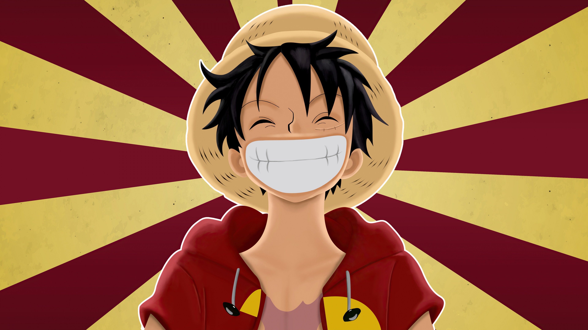

# 🏴‍☠️ Luffy's Journey

A visual tribute to Monkey D. Luffy's journey through every major arc of One Piece — built as an HTML/CSS practice project.

## Preview

Hover over each arc card to see a GIF from that saga.

## Features

- Hover-reveal GIF per arc (East Blue → Egghead)
- Ocean-themed gradient background
- Circular profile image with coral border
- Google Fonts (`Happy Monkey`)
- Fully static — no JavaScript

## Arcs Covered

East Blue · Arabasta · Sky Island · Water 7 · Summit War · Fish-Man Island · Dressrosa · Whole Cake Island · Wano · Egghead

## Built With

- HTML5
- CSS3 (Flexbox, `background-image` hover swap, linear-gradient)

## What I Practiced

- Flexbox layout
- CSS hover effects without JavaScript
- Background image sizing and positioning
- Google Fonts integration
- Consistent color theming

## Live Demo

[View on GitHub Pages]([https://itzmanav07.github.io/luffy-journey/])

---

*"I don't want to conquer anything. I just think the guy with the most freedom on the seas is the Pirate King."*
